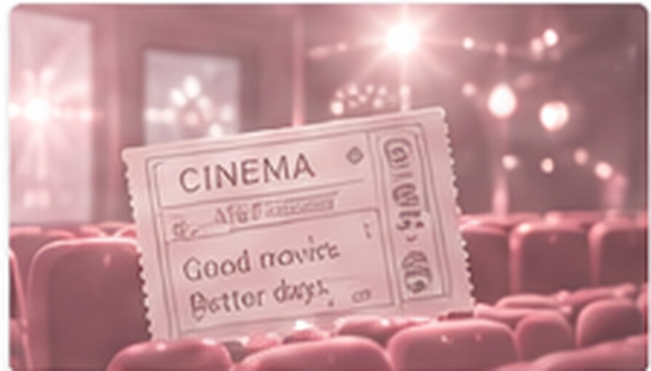
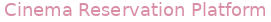
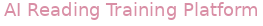
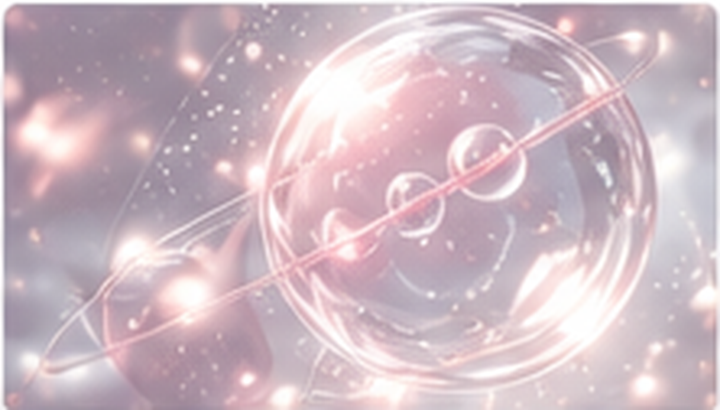
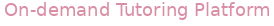
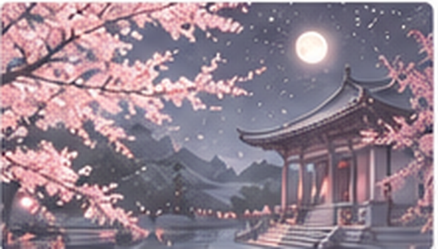
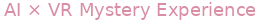
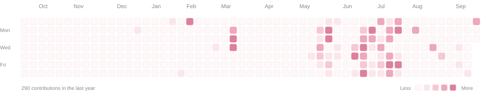
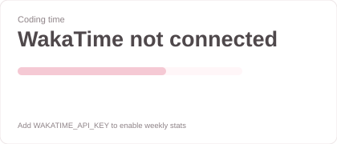
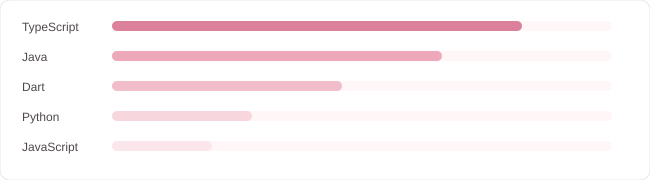

  

<h1 align="center">Ryujin Lee</h1>

Backend Developer · Cloud · Systems

 

  <h3>About</h3>
  
  

    Java / Spring Boot 기반 백엔드와 AWS 인프라를 중심으로 개발합니다. 
    서비스 구조, 실시간 시스템, 보안에도 관심이 있습니다.
  

  

    
      I build backend services with Java and Spring Boot, with a focus on AWS infrastructure. 
      I’m also interested in service architecture, real-time systems, and security.
    
  

<h2> Projects</h2>

<table>
<tr>
<td width="20%" valign="top">

 <b>KINO</b> 
  
영화 목록·상세, 리뷰, 메인 페이지, 예매 필터, 박스오피스 랭킹 기능 구현에 참여한 영화관 웹 서비스.
</td><td width="20%" valign="top">

 <b>NeuroKnot</b> 
  
AI 기반 맞춤형 읽기 훈련을 통해 인지·학습 경험을 돕는 웹 플랫폼.
</td><td width="20%" valign="top">

 <b>Icarus-Tether</b> 
  
AI 에이전트의 도구 호출을 실행 직전에 점검해 민감 데이터 유출을 차단하는 보안 게이트웨이.
</td><td width="20%" valign="top">

 <b>ONSAEM</b> 
  
실시간 매칭, 화상 강의, 화이트보드 기능을 포함한 온디맨드 과외 매칭 플랫폼.
</td><td width="20%" valign="top">

 <b>IMUNROK</b> 
  
Meta Quest 3 기반 AI NPC 상호작용형 VR 추리 경험 프로젝트.
</td>
</tr>
</table>

 

<table>
<tr>
<td width="68%" valign="top">

<h2> Tech Stack</h2>

**Main**

**Also Used**

</td>
<td width="32%" valign="top">

<h2> Certifications</h2>

<table>
<tr><td><b>네트워크관리사 2급</b> Network Administrator Level 2</td></tr>
<tr><td><b>SQLD</b> SQL Developer</td></tr>
<tr><td><b>ADsP</b> Advanced Data Analytics Semi-Professional</td></tr>
</table>

</td>
</tr>
</table>

 

<h2> Activity</h2>

  

 

<table>
<tr>
<td width="40%" valign="top">

<h2> This Week</h2>

  

</td>
<td width="60%" valign="top">

<h2> Languages</h2>

  

</td>
</tr>
</table>

<!--
FUTURE OPTION — Recently Played (Spotify)

When Spotify is connected later, this block can replace the "This Week" card
or be added as a second row. It is intentionally commented out while Melon is used.

<h2> Recently Played</h2>

  

-->

 

<h2> Contact</h2>

  
  

